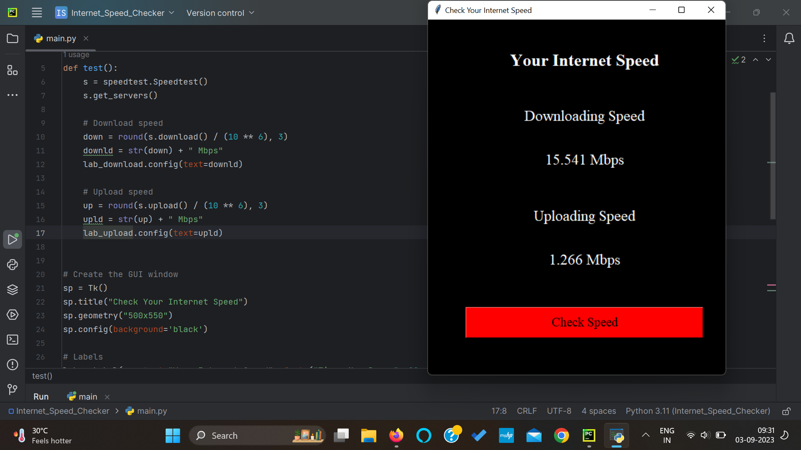

# Internet Speed Checker



This simple Python application allows you to check your internet speed with just a click of a button. It utilizes the `speedtest` library to measure both download and upload speeds and displays the results in a user-friendly graphical user interface (GUI) built with `tkinter`.

## Features

- Check your internet download and upload speeds.
- A clean and easy-to-read GUI for a smooth user experience.
- Results displayed in Mbps for clarity.
- Quick and convenient speed checking.

## Installation

1. Ensure you have Python installed on your system.
2. Clone this repository to your local machine:

   ```
   git clone https://github.com/shriyaa01/Internet-Speed-Checker.git
   ```

3. Change the directory to the cloned repository:

   ```
   cd Internet-Speed-Checker
   ```

4. Run the `main.py` script:

   ```
   python main.py
   ```

## Usage

1. Launch the application by running `main.py`.
2. Click the "Check Speed" button to initiate the speed test.
3. The application will display your current download and upload speeds.

## Dependencies

This project relies on two Python libraries:

- `tkinter`: For building the graphical user interface.
- `speedtest`: For measuring internet speeds.

You can install the `speedtest` library using `pip`:

```
pip install speedtest-cli
```

## Contributions

Contributions are welcome! If you have any suggestions or improvements, please feel free to open an issue or submit a pull request.

Don't forget to give this repository a ⭐️ if you found it useful! Your support is highly appreciated. Additionally, consider following me on GitHub to stay updated with my latest projects.


